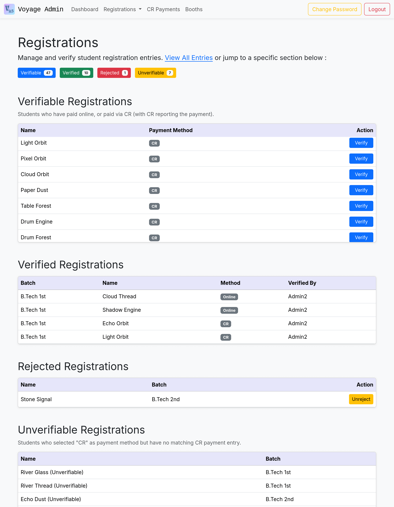
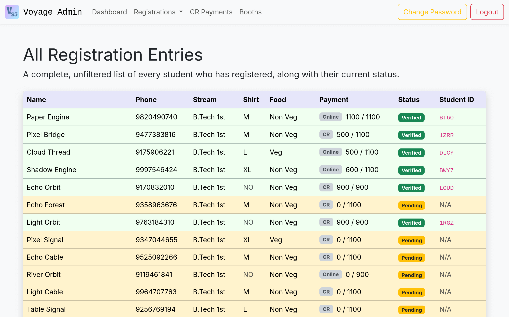
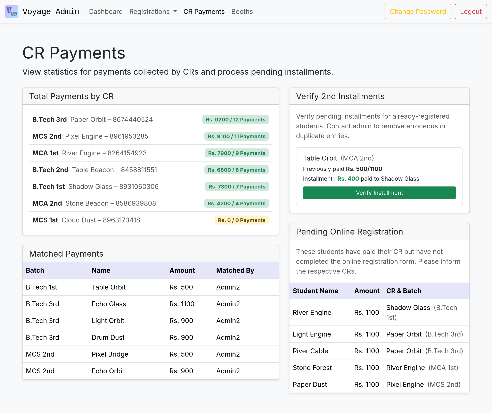
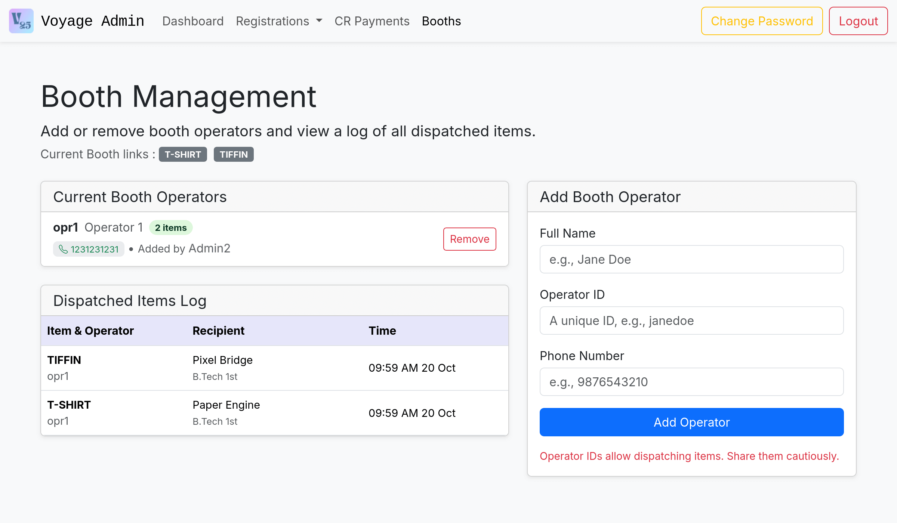
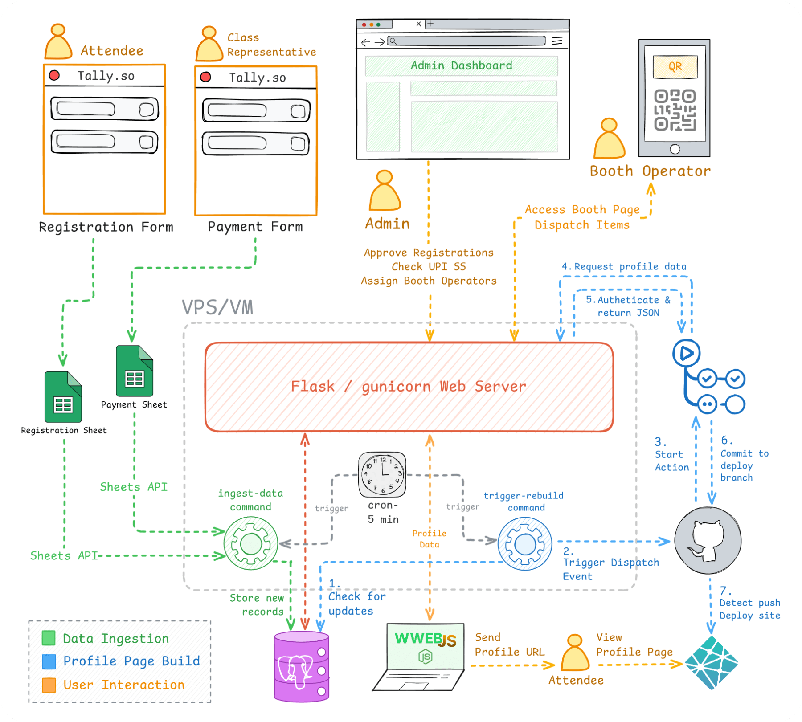

# Voyage 2k25 Admin Backend & Automation Suite


An admin backend and automation suite built to handle logistics for a departmental fest, from managing registrations and payments to distributing items on-site. For the Voyage 2k25 event, this system managed **120+ attendees**, **150+ on-site item distributions**, and over **₹1.2L** in contributions.

<div align="center">

**[Showcase](#showcase) &nbsp;•&nbsp; [Context](#context--impact) &nbsp;•&nbsp; [Architecture](#technical-architecture) &nbsp;•&nbsp; [Usage](#usage)**

</div>

## Showcase

The system primarily features an admin panel and a live booth operator page (showcased below). The deployment pipeline also generates unique profile pages for attendees; you can view a **[demo profile](voyage-profiles.netlify.app/QDXZ)** generated by this repository or my **[actual profile](https://voyage2k25.netlify.app/p/HXSM)** from the event.


| Admin Workflow: Login, Dashboard & Verify Registration | Booth Page Operation |
| :---: | :---: |
| <video src="https://github.com/user-attachments/assets/5b44c657-94f7-4eea-926c-95c1a3c6bcb5"></video> | <video src="https://github.com/user-attachments/assets/8fab36b3-57dc-45e9-8771-f8067a9457df"></video> |

<details>
<summary><h3>Additional Screenshots</h3></summary>

| Registrations Management | All Registrations View |
|---|---|
|  |  |

| CR Payment Dashboard | Booth Management |
|---|---|
|  |  |

</details>

    
## Context & Impact

When I was entrusted to manage the fund collection for our departmental fest (Voyage 2k25), I quickly realized there were several logistical obstacles — which earlier processes failed to address. Registrations were often collected through informal lists from Class Representatives, and payments were tracked and reconciled manually. This often caused inefficiencies and confusion, especially when it came to the on-site distribution of items like T-shirts and meal packets.

The first step towards automation was introducing structured data collection using multi-step **[Tally.so](https://tally.so)** forms for both Attendees and Class Representatives, which were integrated with **Google Sheets**. While this consolidated the raw registration information and payment proofs into a couple of Sheets, a centralized application was still needed for admins to **verify registrations against CR payments**, **validate payment screenshots**, and provide a **booth service for dispatching items**.

I built this application to address those needs, but faced an early challenge: data collection had to start before the app itself was ready. This was solved with a **decoupled data ingestion pipeline** that polled the Google Sheets API for new entries. For the event itself, the app ran on a **Google Cloud Platform (GCP)** VM and used a **Supabase PostgreSQL** instance. Since then, the codebase has been significantly refactored with a standardized structure, major UI improvements, and Docker containerization.

Leading up to the fest, the system managed over **₹1.2L** in student contributions. Upon admin verification, a WhatsApp worker automatically sent confirmations and unique profile links to **120+ attendees**. During the event, the booth pages handled the distribution of **150+ items** smoothly. Afterward, the data stored in the PostgreSQL instance was essential for the final audit and enabled a transparent accounting of funds and inventory.

## Technical Architecture

This diagram illustrates the complete, end-to-end flow of the system as it was run for the event.



### Tech Stack

| Category | Technology |
|---|---|
| **Backend** | Python, Flask, Gunicorn, Peewee ORM |
| **Database** | PostgreSQL (Production), SQLite (Optional, for development) |
| **Frontend (Admin)** | HTML, Bootstrap 5, JavaScript |
| **Infrastructure** | GitHub Actions, Netlify, GCP, Docker |
| **Operational Tools** | Google Sheets API, `whatsapp-web.js` (Node.js) |

### Key Features
- **Secure Admin Panel:** Session-based authentication for admins, with login/logout, password management, and hCaptcha protection on the login page.
- **Comprehensive Operations:** Admins can verify/reject registrations, approve payments, add/remove booth operators, and review all operational data.
- **Scheduled Data Ingestion:** A `cron`-scheduled script periodically syncs new entries from two Google Sheets.
- **Automated Profile Updates:**  When admin actions or profile updates flag the database for an update, a `cron`-scheduled script detects it and triggers a GitHub Action to rebuild and deploy the static profile pages to Netlify.
- **Interactive Booth Page:** A secure, mobile-friendly page authenticated with Operator ID and featuring a **live QR code scanner** to fetch student data and dispatch items.
- **Automated WhatsApp Notifications:** A decoupled `whatsapp-web.js` worker  polls the backend for new verifications and automatically sends attendees a confirmation message with a link to their profile page.

## Usage

The project is set up to run with Docker and PostgreSQL. However, simpler setups are possible with only a Python virtual environment and/or SQLite.


### Running with Docker (Recommended)
1.  **Clone the Repository:**
    ```bash
    git clone https://github.com/your-username/voyage-fest-app.git
    cd voyage-fest-app
    ```
2.  **Configure Environment Variables:**
    Create a `.env` file from the template and fill in your secrets (database URI, API keys, etc.).
    ```bash
    cp .env.example .env
    # Now, edit the .env file with your credentials
    ```

    > **Platform-Specific Docker Configuration**
    >
    > Please note: The Docker setup was tested on a Linux host. It uses `network_mode: host` in the `docker-compose.yml` file to allow the container to connect to a PostgreSQL database running on `localhost`.
    >
    > This setting **will not work** on Docker Desktop for macOS or Windows.
    >
    > For those platforms, a common approach is to remove `network_mode: host` and use `host.docker.internal` in your `DATABASE_URI`. This specific configuration has not been tested, so adjust as needed.

  
3.  **Build and Run the Application:**
    This command builds the Docker image and starts the web server.
    ```bash
    docker compose up --build
    ```
4.  **Initialize the Database (First-Time Setup):**
    In a new terminal, run these one-time commands to create the database tables, add an admin user, and optionally seed the database with sample data.
    ```bash
    # Create database tables
    docker compose run --rm web flask init-db

    # Create an admin user (you will be prompted for credentials)
    docker compose run --rm web flask add-admin

    # (Optional) Seed the database with dummy data
    docker compose run --rm web flask seed-data
    ```

<details>
<summary><h3>Manual Local Setup</h3></summary>

For a quick setup without Docker, you can use a local SQLite database.

1.  **Create and Activate a Virtual Environment**
    *   On macOS/Linux:
        ```bash
        python3 -m venv venv
        source venv/bin/activate
        ```
    *   On Windows:
        ```powershell
        python -m venv venv
        .\venv\Scripts\Activate.ps1
        ```

2.  **Install Dependencies**
    ```bash
    pip install -r requirements.txt
    ```
3.  **Configure the Environment**
    Create a **`.env`** file from the template.
    ```bash
    cp .env.example .env
    ```
    Then, open the `.env` file and set `USE_SQLITE="True"` in it.

4.  **Navigate to the Backend Directory:**
    The Flask commands must be run from inside the `backend` folder.
    ```bash
    cd backend
    ```

5.  **Initialize the Database:**
    Run these one-time commands to create the tables and your admin user.
    ```bash
    # Create database tables
    flask init-db
    
    # Create an admin user
    flask add-admin
    
    # (Optional) Seed the database with dummy data
    flask seed-data
    ```

6.  **Start the Development Server**
    ```bash
    flask run
    ```
    The application will be available at `http://127.0.0.1:5000`.

</details>

## Future Improvements

- **Implement Database Migrations:** Integrate a tool like `peewee-db-evolve` to manage schema changes programmatically.
- **Rate Limiting outside the Application:** Move the rate-limiting logic to a reverse proxy for better performance.
- **Comprehensive Test Suite:** Add unit and integration tests to improve  reliability and enable safer refactoring.